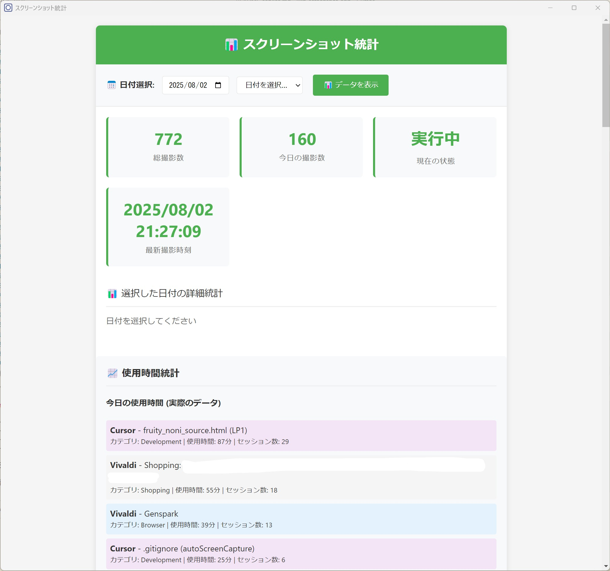

# 自動スクリーンキャプチャ & 使用時間分析アプリケーション

Windowsで定期的にスクリーンショットを自動撮影し、アプリケーション使用時間を詳細に分析するElectronアプリケーションです。



## 🚀 主要機能

### 📸 スクリーンショット機能
- **定期的な自動撮影**: 設定可能な間隔でスクリーンショットを自動撮影
- **アクティブウィンドウ追跡**: フォーカスされているウィンドウの情報を記録
- **高品質画像処理**: Sharpライブラリによる高解像度画像生成
- **保存フォルダ管理**: カスタマイズ可能な保存先ディレクトリ

### 📊 使用時間分析機能
- **リアルタイム追跡**: アプリケーションの使用時間をリアルタイムで追跡
- **詳細統計**: 日別・時間別の使用時間分析
- **アプリケーション分類**: ブラウザ、開発ツール、一般アプリケーションの自動分類
- **アイドル検出**: システムアイドル状態の自動検出と除外
- **SQLiteデータベース**: 永続的な使用データの保存

### 🎯 統計・分析機能
- **日別使用統計**: 日付別の詳細な使用時間レポート
- **アプリケーション別分析**: 各アプリケーションの使用時間と割合
- **カテゴリ別集計**: ブラウザ、開発、一般アプリケーションの分類統計
- **ピーク時間分析**: 最もアクティブな時間帯の特定
- **セッション管理**: 有効な使用セッションの記録（1分未満は除外）

### 🔧 システム機能
- **3つの起動モード**: バックグラウンド、開発、フォアグラウンド
- **Windows自動起動**: システム起動時の自動開始機能
- **システムトレイ統合**: トレイアイコンからの完全操作
- **プロセス管理**: 重複起動防止と自動再起動機能
- **詳細ログ記録**: デバッグとトラブルシューティング用ログ

## 🧩 前提条件

- Windows 10/11
- Node.js 16以上
- Electron 28以上（`npm install` 時に自動インストールされます）

## 📦 インストール

```bash
# 依存関係のインストール（このディレクトリで実行）
npm install
```

## 🛠️ 起動方法

### 方法1: バッチファイルを使用（推奨）
```bash
# バックグラウンドモード（デフォルト）
start.bat

# 開発モード（コンソール表示、デバッグログ）
start-dev.bat

# フォアグラウンドモード（コンソール表示）
start-foreground.bat

# アプリケーションを停止
stop.bat
```

### 方法2: npmコマンドを使用
```bash
# バックグラウンドモード
npm start

# 開発モード
npm run start-dev

# フォアグラウンドモード
npm run start-foreground

# 開発用（TypeScript直接実行）
npm run dev
```

### 方法3: 直接実行
```bash
# ビルド後に実行
npm run build

# バックグラウンドモード
npx electron dist/main.js --background

# 開発モード
npx electron dist/main.js --dev

# フォアグラウンドモード
npx electron dist/main.js --foreground
```

## 📋 使用方法

### 基本操作
1. アプリケーションを起動すると、システムトレイにアイコンが表示されます
2. トレイアイコンを右クリックして「設定」を選択
3. 保存フォルダと撮影間隔を設定
4. 「スクリーンショット開始/停止」で撮影を開始/停止

### トレイメニュー
- **スクリーンショット開始/停止**: 定期撮影のオン/オフ
- **設定**: 保存フォルダや撮影間隔などを変更
- **統計を表示**: 日別・アプリ別の使用統計ウィンドウを開く
- **画像最適化**: スクリーンショットをWebPに変換して容量削減
- **データメンテナンス**: 保持期間を超えた古い統計データを削除
- **ログを表示**: ログファイル（`app.log`）を開く
- **終了**: アプリケーションを安全に終了
- **サービス情報**: 現在の起動モードや稼働時間などを表示

### 統計画面の利用
1. システムトレイから「統計を表示」を選択
2. 日別の使用時間統計を確認
3. アプリケーション別・カテゴリ別の分析を閲覧
4. ピーク時間帯の分析結果を確認

## ⚙️ 設定項目

### スクリーンショット設定
- **保存フォルダ**: スクリーンショットの保存先
- **撮影間隔**: 1分〜1時間の間で設定可能
- **自動開始**: Windows起動時に自動で開始するかどうか

### 使用時間追跡設定
- **最小セッション時間**: 1分未満の使用は統計から除外
- **アイドル検出時間**: 5分間の無操作でアイドル状態と判定
- **データベース保存**: SQLiteによる永続的なデータ保存

### デフォルト設定（初回起動時に自動生成）

```json
{
  "saveDirectory": "%USERPROFILE%\\Documents\\Screenshots",
  "captureInterval": 180000,
  "autoStart": true,
  "statisticsConfig": {
    "dataRetentionDays": 90,
    "cleanupIntervalHours": 24,
    "enableImageOptimization": true,
    "webpQuality": 80
  }
}
```

### データ保存場所
- **スクリーンショット**: 上記の保存フォルダ（既定: `ドキュメント\\Screenshots`）
- **使用時間データベース**: `%APPDATA%\\win-screenshot-app\\usage-statistics.db`
- **ログファイル**: `%APPDATA%\\Electron\\logs\\app.log`（トレイの「ログを表示」から開けます）

## 🔄 起動モード

### バックグラウンドモード（デフォルト）
- シェルから完全に分離して動作
- コンソールウィンドウは非表示
- シェルを閉じてもアプリケーションは継続動作
- システムトレイからのみ操作可能

### 開発モード
- コンソール出力とデバッグログが有効
- キーボードショートカット利用可能
- 開発・デバッグ用

### フォアグラウンドモード
- コンソールが表示される
- 親プロセスとの接続を維持
- ウィンドウを閉じるとアプリケーションも終了

## 💻 コマンドラインオプション

| オプション | 短縮形 | 説明 |
|-----------|--------|------|
| `--background` | `-b` | バックグラウンドモードで起動 |
| `--dev` | `-d` | 開発モードで起動 |
| `--foreground` | `-f` | フォアグラウンドモードで起動 |
| `--help` | `-h` | ヘルプメッセージを表示 |

## 📊 データ分析機能

### 日別統計
- 総画面時間の計算
- アプリケーション別使用時間の内訳
- カテゴリ別使用時間の集計
- 時間帯別のピーク分析

### アプリケーション分類
- **ブラウザ**: Chrome、Edge、Firefox等のWebブラウザ
- **開発ツール**: VS Code、Visual Studio等の開発環境
- **一般アプリケーション**: その他のアプリケーション

### データベース機能
- SQLiteによる高速データアクセス
- 自動データベース初期化
- データ整合性の保証
- 効率的なクエリ処理

## 🧪 テスト

```bash
# 全テスト
npm test

# 統計マネージャーのみ
npm test -- --testPathPattern="StatisticsManager"

# 画像最適化のみ
npm test -- --testPathPattern="ImageOptimizer"
```

## 🚧 今後の機能追加予定

### 📈 統計機能の拡張
- **フィルタリング機能**: 日付範囲、アプリケーション、カテゴリによる絞り込み
- **ソート機能**: 使用時間、アプリケーション名、日付による並び替え
- **エクスポート機能**: CSV/Excel形式での統計データ出力
- **グラフ表示**: 使用時間の可視化チャート
- **比較分析**: 期間別の使用時間比較

### 🔍 高度な分析機能
- **生産性スコア**: アプリケーション使用パターンによる生産性評価
- **習慣分析**: 定期的な使用パターンの検出
- **目標設定**: 使用時間の目標設定と進捗管理
- **アラート機能**: 過度な使用時間の通知

### 🎨 UI/UX改善
- **ダッシュボード**: リアルタイム統計の統合表示
- **カスタマイズ**: テーマとレイアウトのカスタマイズ
- **ショートカット**: キーボードショートカットの追加
- **通知**: 重要な統計情報の通知機能

## ⚠️ 注意事項

- バックグラウンドモードでは、シェルを閉じてもアプリケーションは動作し続けます
- 完全に停止するには `stop.bat` を実行するか、トレイアイコンから「終了」を選択してください
- 初回起動時は設定画面で保存フォルダを選択する必要があります
- 重複起動は自動的に防止されます
- 使用時間追跡は1分以上のセッションのみ記録されます
- アイドル状態（5分間無操作）では追跡が一時停止されます

## 🛡️ セキュリティ・プライバシー

- すべてのデータはローカルに保存され、外部に送信されることはありません
- スクリーンショットは指定されたフォルダにのみ保存されます
- 使用時間データはSQLiteデータベースに暗号化されずに保存されます
- アプリケーション終了時に適切なデータクリーンアップが実行されます

## 📎 関連ドキュメント

- バックグラウンドサービスや起動モードの詳細: `README-service.md`
- 統計機能・画像最適化の技術詳細: `STATISTICS_FEATURES.md`
